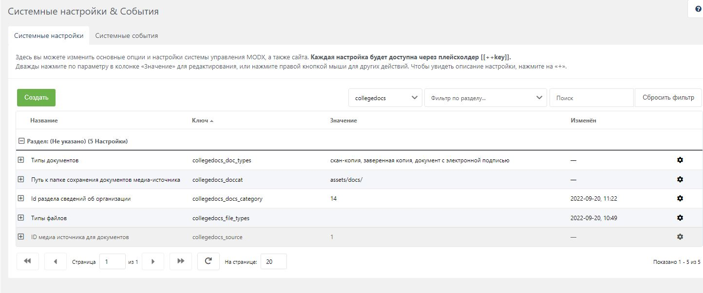
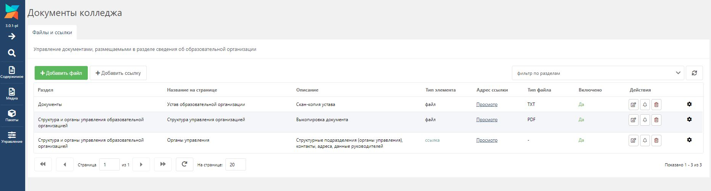
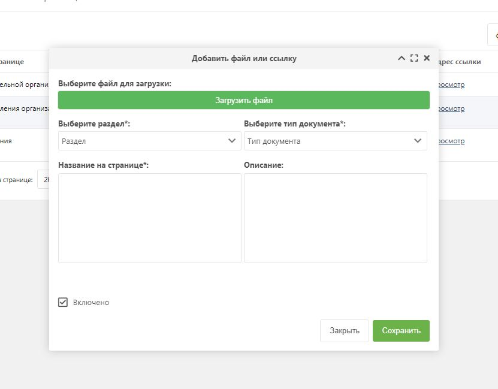
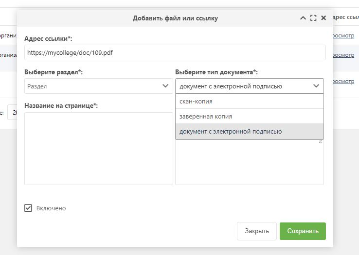

# College Docs

Компонент управления документами для образовательных организаций, использующих CMS MODX

## Кому и зачем это нужно
В первую очередь образовательным организациям.  
Все колледжи и вузы должны иметь на своем официальном сайте раздел "Сведения об образовательной организации" в соответствии с требованиями Рособрнадзора.  
Контент-менеджерам или сотрудникам организации обычно неудобно переходить от страницы к странице и вручную добавлять, удалять или редактировать обязательные для размещения файлы и документы.  
Компонент College Docs позволяет из системы администрирования управлять связью страниц и разделов сайта с файлами и ссылками.

## Что умеет
1. Добавлять файлы к ресурсам
2. Добавлять ссылки на сторонние файлы и документы к ресурсам
3. Управлять отображением файлов на страницах сайта
4. Аккуратно складывать файлы в отдельные папки

## Как работает
1. Скачайте и установите компонент на свою сборку MODX 3
2. Задайте системные настройки для "collegedocs":
   - Типы документов (например: скан-копия, документ с электронной подписью)
   - Путь к папке сохранения документов медиа-источника
   - ID раздела сведений об организации
   - ID медиа источника для документов
3. Откройте раздел Пакеты и выберите "Документы колледжа"
4. Добавляйте, удаляйте, включайте, отключайте файлы и ссылки для страниц вашего сайта

**Обратите внимание, что компонент поставляется без чанков и сниппетов для вывода на странице, их придется написать самостоятельно!**

## Скриншоты

1. Настройки перед началом работы
   

2. Администрирование файлов  
   

3. Добавление/загрузка файла и описание
   

4. Добавление ссылки и описание
   
